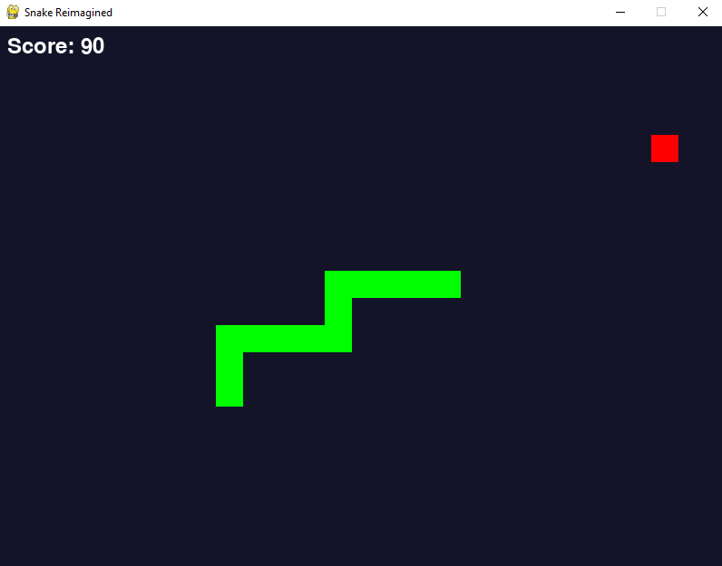

# Snake Game 🐍

A modern, feature-rich implementation of the classic Snake game using Pygame, with configurable difficulty levels and smooth gameplay.




## 🎮 Game Features

### Difficulty Levels
- **Easy Mode**: 
  - Slower snake movement
  - Larger game grid
  - More forgiving wall collision (wrap-around)
  - Longer initial snake length

- **Medium Mode**: 
  - Standard snake movement speed
  - Regular grid size
  - Normal wall collision
  - Standard initial snake length

- **Hard Mode**: 
  - Faster snake movement
  - Smaller game grid
  - Strict wall collision
  - Shorter initial snake length

### Game Mechanics
- Classic Snake gameplay
- Dynamic food spawning
- Collision detection
- Real-time score tracking
- Intuitive menu system

## 🚀 How to Run

1. **Create environment with conda**
```bash
conda create -n snake pygame --yes
conda activate snake
```

2. **Clone the repository**
```bash
git clone https://github.com/AhmedOsamaMath/snake-game.git
cd snake-game
```

3. **Run the game**
```bash
python main.py
```

## 🎮 Controls

### Menu Navigation
- **UP/DOWN Arrows**: Navigate menu options
- **ENTER**: Select/Start
- **ESC**: Return to previous menu

### Gameplay
- **Arrow Keys**: Control snake direction
- **R**: Restart game (after game over)
- **ESC**: Return to main menu

## 📦 Project Structure
- `main.py`: Main game entry point
- `game_states.py`: Game state management
- `settings.py`: Game configuration and difficulty settings
- `game_manager.py`: Core game logic and rendering

## 🔧 Customization
Easily modify game parameters in `settings.py`:
- Screen dimensions
- Color schemes
- Difficulty settings

## 📝 License
This project is licensed under the MIT License. See the [LICENSE](./LICENSE) file for details.
